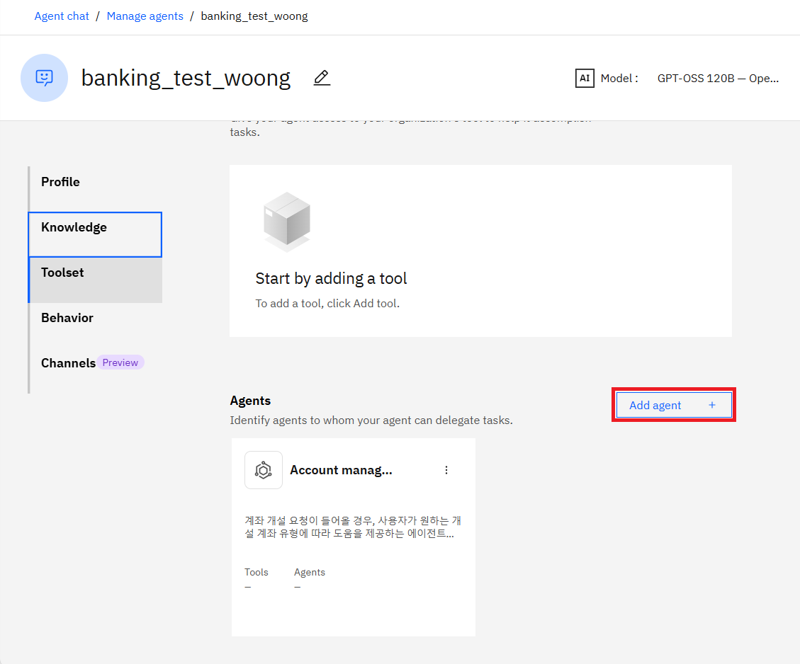
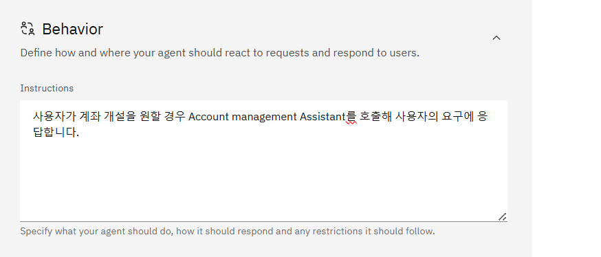

# AI Assistant를 Create Agent에서 호출하는 방법


## 1. Add Agent 클릭



1. 사용할 AI Assistant 선택
2. Display name은 Assistant 선택 시, 자동 매핑
3. Description에 해당 AI Assistant에 대한 간략한 설명 입력

```
Description :
    계좌 개설 요청이 들어올 경우, 사용자가 원하는 개설 계좌 유형에 따라 도움을 제공하는 에이전트입니다. 
    이 에이전트는 사용자가 계좌 개설을 원할 경우, 개설할 수 있는 계좌 선택지를 제공하며, 선택지에 따라 상담원에게 연결하는 역할을 합니다.
```



```
    Instructions : 
        사용자가 계좌 개설을 원할 경우 Account management Assistant를 호출해 사용자의 요구에 응답합니다.
```