# 🧑‍💼 AskHR: 에이전트 AI로 HR 작업 자동화

## 목차

- [사용 사례 설명](#use-case-description)
- [아키텍처](#architecture)
- [사전 준비사항](#pre-requisites)
- [핸즈온 가이드](#핸즈온-가이드)
  - [에이전트 빌더 열기](#에이전트-빌더-열기)
  - [HR 에이전트 생성](#hr-에이전트-생성)
  - [미리보기에서 HR 에이전트 테스트](#미리보기에서-hr-에이전트-테스트)
  - [AI 채팅에서 HR 에이전트 테스트](#hr-agent-ai-chat-테스트)

## 사용 사례 설명

이 사용 사례는 제공된 아키텍처 다이어그램에 설명된 대로 IBM watsonx Orchestrate를 활용하여 AskHR 에이전트를 개발하고 배포하는 것을 목표로 합니다. 이 에이전트는 직원들이 대화형 AI를 통해 HR 시스템과 상호 작용하고 정보에 효율적으로 액세스할 수 있도록 지원합니다.

이 실습에서는 watsonx Orchestrate에서 HR 에이전트를 구축하고, 도구와 외부 지식을 활용하여 시뮬레이션된 인적 자본 관리 시스템에 연결합니다. 이 에이전트는 문서에서 관련 정보를 검색하여 사용자 쿼리에 답변하고 사용자가 자신의 프로필을 보고 관리할 수 있도록 합니다.

## 아키텍처


## 사전 준비사항

 - 계속하기 전에 강사에게 **모든 시스템**이 정상적으로 실행되고 있는지 확인하십시오.
 - 이 실습에 적합한 TechZone 환경에 액세스할 수 있는지 확인하십시오.
 - 실습을 시작하기 전에 강사가 공유할 자격 증명 파일에 액세스할 수 있는지 확인하십시오.
 - 이 실습을 진행하는 강사인 경우 **강사 가이드**를 확인하여 모든 환경과 시스템을 설정하십시오.


## 핸즈온 가이드

### 에이전트 빌더 열기

 - IBM Cloud(cloud.ibm.com)에 로그인합니다. 왼쪽 상단의 햄버거 메뉴로 이동한 다음 리소스 목록으로 이동합니다. AI/Machine Learning 섹션을 엽니다. **watsonx Orchestrate** 서비스가 표시되면 클릭하여 엽니다.

   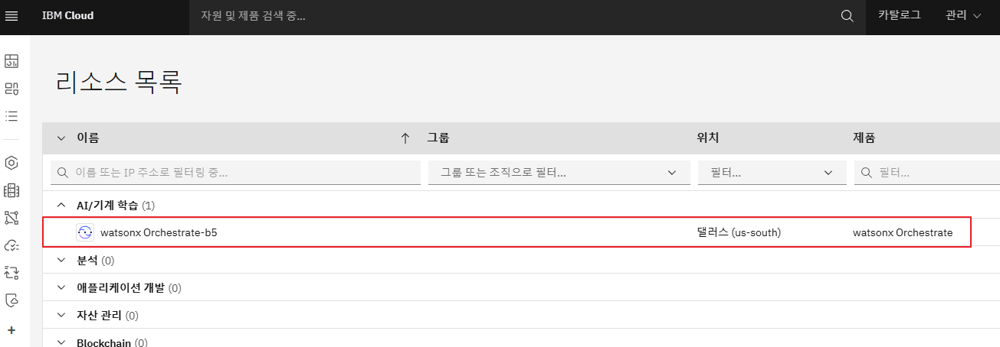

 - "watsonx Orchestrate 시작" 버튼을 클릭합니다.

   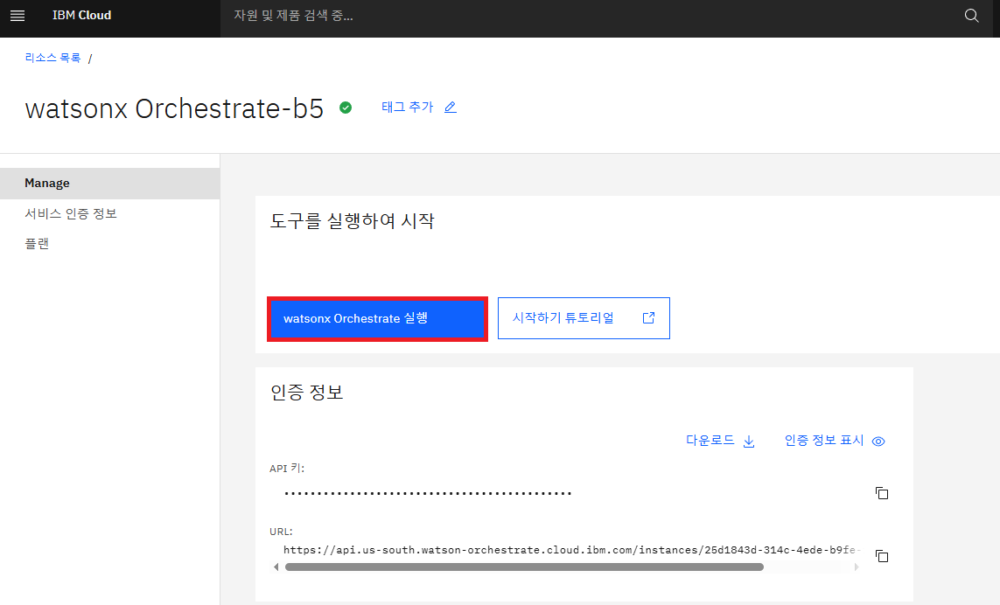

 - watsonx Orchestrate에 오신 것을 환영합니다. 햄버거 메뉴를 열고 **빌드** 옆의 아래쪽 화살표를 클릭합니다. 그런 다음 **에이전트 빌더**를 클릭합니다:

   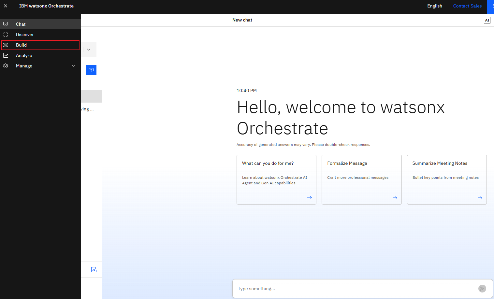

### HR 에이전트 생성
1. **에이전트 생성 +**을 클릭합니다:

   

1. **처음부터 만들기**를 선택하고 에이전트 이름을 지정합니다(예: `HR Agent`). 아래와 같이 **설명**을 입력합니다:   
   - **주의사항** : 명명규칙
      - 다수의 인원이 한 자원을 사용하므로 반드시 명명규칙을 지켜 주시기 바랍니다.
      - 명명규칙 : <자기이름>_AskHR
   - 이름 (예) : 
      ```
      Seongman_AskHR
      ```
   - 설명 :

      ```
      당신은 직원들의 HR 관련 문의를 처리하는 AI 에이전트입니다.  
      응답은 200단어 이하로 간결하고 명확하게 제공합니다.
      다음과 같은 업무를 지원합니다:
        - 직원 프로필 조회
        - 연차(휴가) 잔여일 확인
        - 직책 또는 주소 변경
        - 휴가 신청 처리
        - 사내 복리후생 관련 일반 문의 응답
      ```  
   - **좋은 설명(Description)이란 무엇인가?**  
      설명은 에이전트의 범위를 개략적으로 제시하지만, 에이전트의 실제 동작 방식에는 영향을 주지 않는다.
      AI 모델이 사용자를 도울 적절한 에이전트를 선택할 수 있도록 하려면, 다음 요소들을 고려해야 한다:

      - **도메인 전문성(Domain expertise)**
         AI 어시스턴트가 전문적으로 다루는 도메인이나 주제를 명확히 기술한다. 도메인과 관련된 키워드를 사용한다.

      - **기능과 강점(Features and strengths)**
         AI 어시스턴트가 가진 고유한 기능과 강점을 강조하고, 사용자가 어떤 의도로 프롬프트를 입력할지 고려한다.

      - **제한사항과 범위(Limitations and scope)**
         AI 어시스턴트가 가진 한계와 지식의 범위를 정의한다. 이러한 정의는 오해를 줄이는 데 도움이 된다.

      - **명확하고 단순한 언어(Clear and simple language)**
         AI 어시스턴트의 목적과 기능을 전달할 때는 단순하고 직설적인 언어를 사용한다.

   **생성**을 클릭합니다:

   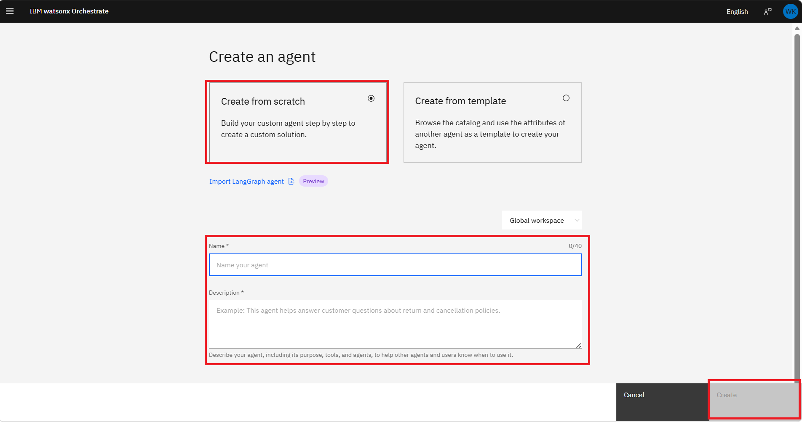
<!--   
1. Click on the down arrow against **Model**. Select Model "llama-3-405b-instruct"

   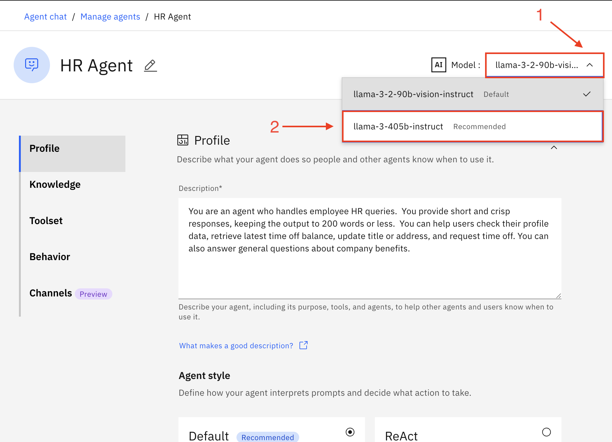
-->   
1. **에이전트 스타일** 섹션에서 **기본값**을 선택합니다.
   - **Default**
      모델이 본래 가지고 있는 이해, 계획, 도구 및 지식 호출 능력에 의존합니다.
   - **ReAct**
      모델이 과제를 완료할 때까지 생각하고, 행동하고, 관찰하며, 접근 방식을 다듬을 수 있도록 합니다.

   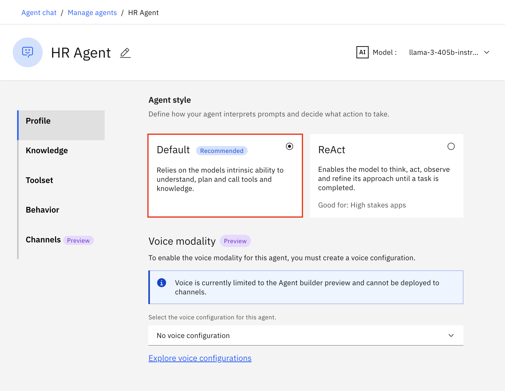
   
1. 화면을 아래로 스크롤하여 **지식** 섹션으로 이동합니다.
   **지식 추가**를 클릭합니다.
   
   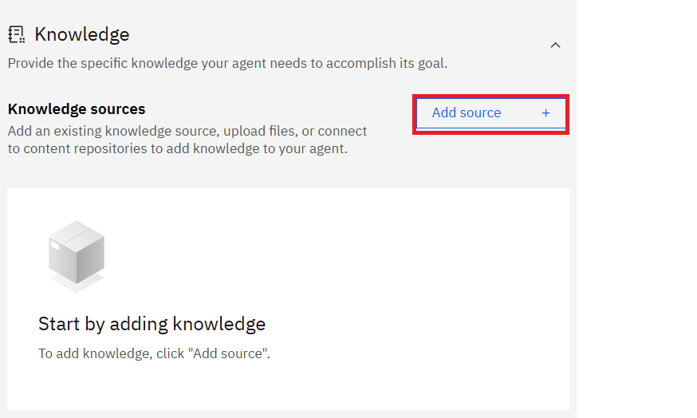

1. **New knowledge**를 클릭합니다.

   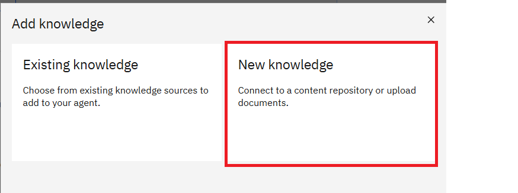

1. 화면을 아래로 스크롤하여 **파일 업로드**를 선택합니다.
   **다음**을 클릭합니다.
   
   
     
1. Employee Benefits.pdf를 시스템에 다운로드한 다음 여기에 파일을 업로드합니다.
   **다음**을 클릭합니다.

   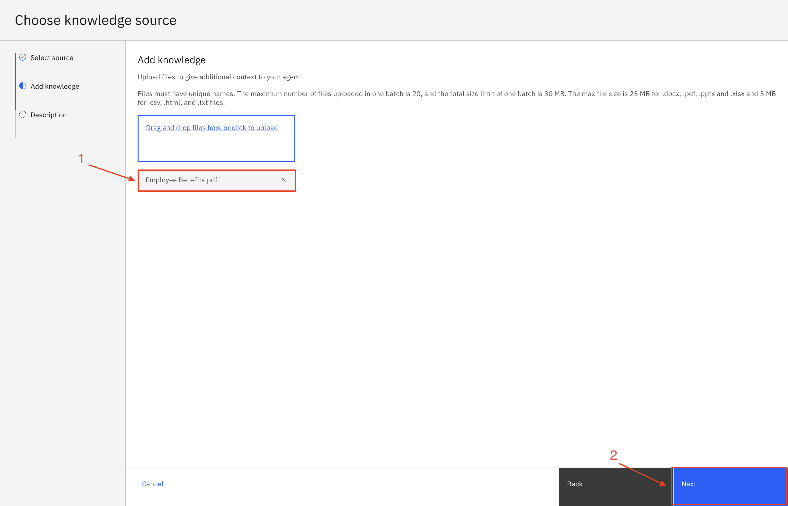

1. 이름을 지정하고, 다음 설명을 **설명** 섹션에 복사한 다음 **저장**을 클릭합니다:

      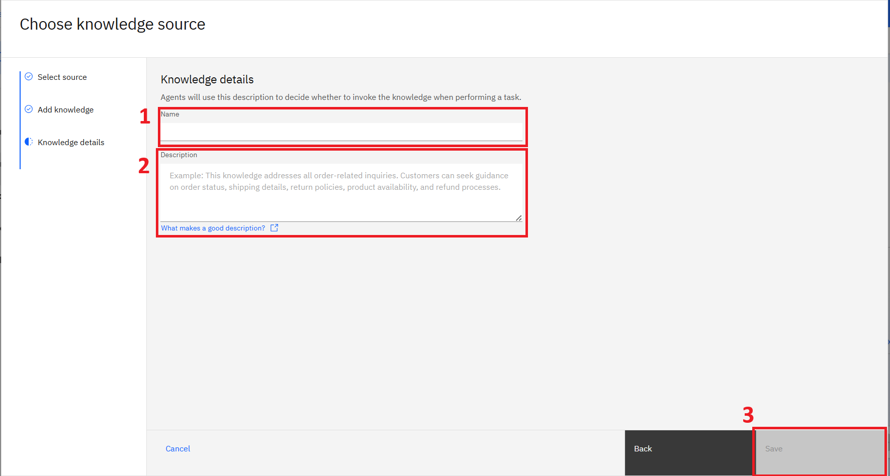

   - **이름** :
      ```
      자기이름_AskHR
      ```
   - **설명** :   
      ```
      이 지식 베이스는 회사의 직원 복리후생과 관련된 내용을 포함합니다.  
      여기에는 육아휴직, 반려동물 정책, 유연 근무제, 학자금 대출 상환 지원 등이 포함됩니다.
      ```
   
   - **설명(Descriptions) 이해하기**  
      에이전트의 지식 베이스에 문서를 업로드할 때는 명확하고 유익한 설명을 포함하세요. 이렇게 하면 에이전트가 데이터를 이해하고 해석하는 데 도움이 되며, 응답 시 해당 지식을 활용할지 아니면 툴 호출이나 대규모 언어 모델(LLM) 사용과 같은 다른 방법에 의존할지를 결정할 수 있습니다.
   - **효과적인 설명을 작성하는 팁**  
      **구체적으로 작성하기**: 콘텐츠 유형과 지원하는 질의 유형을 설명하세요.   
      **간단한 언어 사용하기**: 전문 용어를 피하고 문장을 간단하게 유지하세요.   
      **키워드 포함하기**: 사용자가 검색할 가능성이 높은 용어를 추가하세요.   
      **지속적으로 업데이트하기**: 콘텐츠나 기능이 발전함에 따라 설명을 수정하세요.   
   - **예**
   ```
      이 지식 베이스에는 HR 정책, 직원 핸드북, 복리후생, 휴가, 성과 관리에 관한 가이드라인이 포함되어 있습니다.  
      예를 들어 ‘육아휴직 정책은 무엇인가요?’ 또는 ‘원격 근무는 어떻게 신청하나요?’와 같은 질의에 대응할 수 있습니다.  
      키워드: 휴가 정책, 원격 근무, 복리후생, 성과 평가, 온보딩
   ```
   

1. **도구 세트** 섹션으로 스크롤을 내립니다. **도구 추가 +**를 클릭합니다:

   

1. **Open API**를 선택합니다(화면 이미지와 명칭이 다를수 있습니다.):

   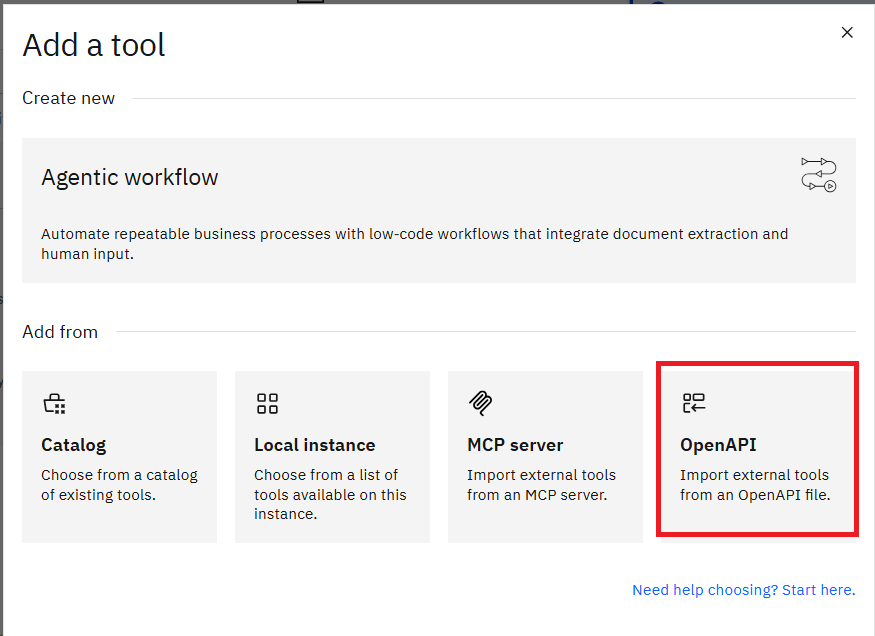


1. 강사가 제공한 **hr.yaml** 파일을 드래그 앤 드롭하거나 클릭하여 업로드한 다음 **다음**을 클릭합니다:

   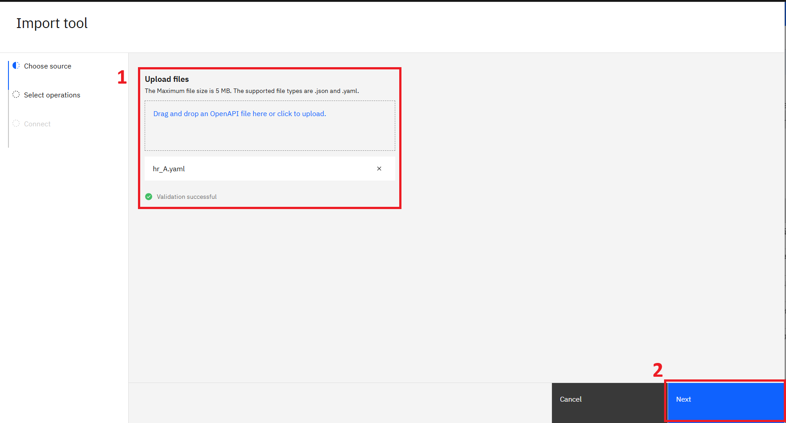    

1. 모든 작업을 선택하고 **완료**를 클릭합니다:

   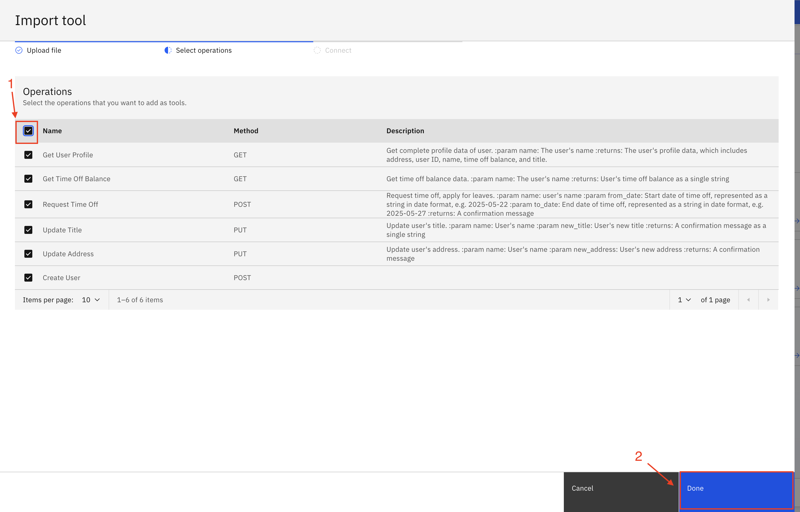

1. **동작(Behavior)** 섹션으로 스크롤을 내립니다. 아래 지침을 **지침(Instructions)** 필드에 삽입합니다:

   ```
    직원 복리후생과 관련된 일반 질문에는 지식 베이스를 활용하여 답변하세요.
    
    사용자 개인 정보 조회 또는 수정 요청 시에는 반드시 도구(API)를 사용하세요.
    
    사용자가 처음으로 다음 요청을 할 경우:
    - 프로필 조회
    - 휴가 잔여일 확인
    - 직책/주소 변경
    - 휴가 신청
    
    → 먼저 사용자의 이름을 물어본 후,  
    → 해당 이름으로 도구를 호출하고  
    → 이후 세션에서는 다시 이름을 묻지 마세요.
    
    사용자가 휴가를 신청할 경우 날짜를 반드시 YYYY-MM-DD 형식으로 변환하세요.
    예: 2025년 5월 22일 → 2025-05-22
   ```
   - **동작(Behavior) 이해하기**  
      AI 에이전트의 동작은 사용자의 요청과 상황에 어떻게 반응하는지를 정의합니다.
      규칙을 설정하여 에이전트가 언제, 어떻게 행동해야 하는지를 지정할 수 있으며, 이를 통해 예측 가능하고 일관된 방식으로 작동하여 매끄러운 사용자 경험을 제공합니다.
      * 새 지침을 추가하면 기존 지침은 덮어쓰기 됩니다.
      * 변경 사항은 자동으로 저장됩니다.
      * 필드를 비워두면, 에이전트는 내장된 기본 동작만 사용합니다. (이 경우, 원하는 요구사항과 맞지 않을 수 있습니다.)
      * 지침은 모든 채널과 작업에 공통 적용됩니다. 현재는 사용자 맥락에 따라 조건부로 적용하는 기능은 지원하지 않습니다.
      * 컨텍스트 변수(Context Variables)는 사용자 맞춤형 정보를 에이전트에 전달할 수 있도록 합니다.
         이를 통해 에이전트는 개인화된 응답을 제공하거나 복잡한 작업을 실행할 수 있습니다.
         예: 이메일 ID, 위치, 회원 ID 같은 사용자별 데이터를 에이전트 동작에 활용 가능
   - **에이전트의 지침이 효과적으로 작동하는지 확인·유지하려면 다음을 수행하세요**
      * 채팅 패널에서 테스트해 새로운 동작이 어떻게 적용되는지 확인합니다.
      * 에이전트를 지원되는 채널에 연결해 실제 환경에서 응답을 평가합니다.
      * 목표나 프로세스 변화에 맞춰 지침을 정기적으로 업데이트합니다.


1. **문서와 채팅** 토글 버튼을 켭니다. **웹 채팅에 인용 표시**에서 **없음**을 선택합니다. **Home Page** 토글 버튼을 켭니다. 에이전트를 배포하려면 오른쪽 상단 모서리에 있는 **배포**를 클릭합니다:

   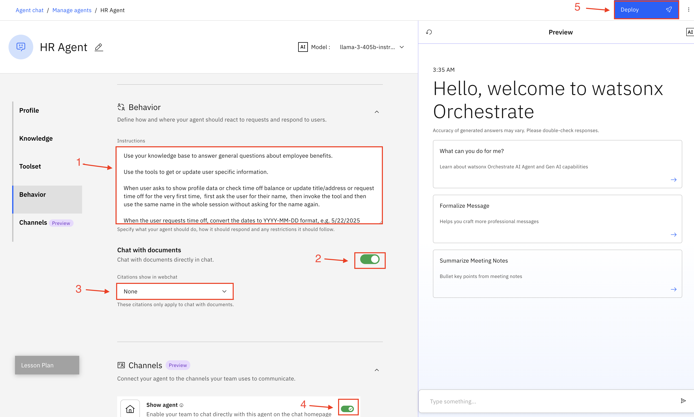

### 미리보기에서 HR 에이전트 테스트
오른쪽 미리보기 채팅에서 다음 질문을 하여 에이전트를 테스트하고 응답을 확인합니다. 아래 스크린샷에 표시된 것과 유사해야 합니다:

```
반려동물 정책이 어떻게 되나요?
```


```
내 프로필 정보를 보여줘
```
이름은 다음 목록중 하나를 선택해서 사용하시면 됩니다.
```
장원영
```
```
카리나
```
```
안유진
```
```
민지
```
```
해린
```
```
지민
```
```
정국
```
```
차은우
```

다음을 테스트 합니다.
```
내 직책을 변경하고 싶어
```
```
수석 AI 엔지니어
```

```
내 주소를 변경해줘
```
```
서울특별시 강남구 테헤란로 123
```
```
내 남은 휴가 일수 알려줘
```

```
휴가 신청할게
```
```
2025년 5월 22일부터 2025년 5월 25일까지
```
```
내 프로필 다시 보여줘
```

#### HR Agent AI Chat 테스트 

AI 채팅 창에서 에이전트를 테스트합니다. 왼쪽 상단 모서리에 있는 햄버거 메뉴를 클릭한 다음 **채팅(Chat)**을 클릭합니다


**HR Agent**가 선택되어 있는지 확인하세요. 이제 에이전트를 테스트할 수 있습니다:
- 자신이 만든 에이전트를 선택합니다. : 예) SeongmanAskHR
