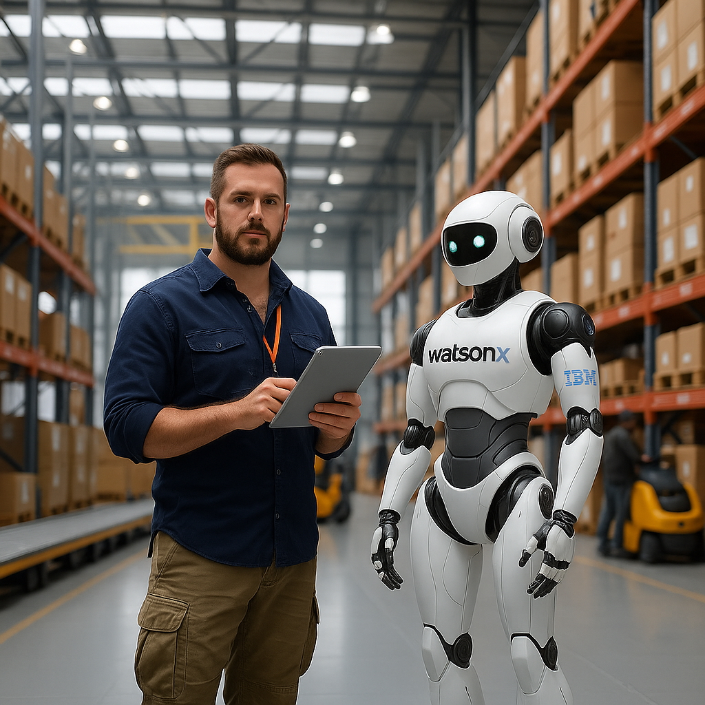

# 지능형 어시스턴트

이 유스케이스는 AI 에이전트가 운영 관리자, 정확히는 창고 관리자를 지원하는 내용에 관한 것입니다. 관리자의 책임 중 하나는 부두에서의 제품 도착 및 출발을 모니터링하고, 재고를 최신 상태로 유지하며, 잉여 제품을 비용 효율적인 방식으로 처리하는 것입니다. 우리는 watsonx Orchestrate 및 watsonx.ai를 기반으로 한 에이전트 솔루션을 적용하여 이 프로세스를 최적화합니다.

## 🤔 문제점
창고 관리 회사인 SmartStorage는 수동 프로세스와 공급망 전반에 걸친 제한된 가시성으로 인해 일상적인 운영에서 상당한 어려움에 직면해 있습니다. 이러한 비효율성은 배송 지연으로 이어져 고객 만족도를 저하시킵니다. 실시간 추적 및 자동화의 부재는 창고 관리자가 제품 이동을 수동으로 조정하고, 창고 부두 상태를 확인하며, 재고를 관리하는 데 상당한 시간을 소비함을 의미합니다. 이는 전체 물류 프로세스를 둔화시킬 뿐만 아니라 인적 오류의 가능성을 높여 지연과 불만을 더욱 악화시킵니다. 이러한 문제를 해결함으로써 SmartStorage는 운영 효율성을 개선하고 서비스 품질을 향상시키는 것을 목표로 합니다.

## 🎯 목표
주요 목표는 인공 지능을 활용하여 제품 흐름을 최적화하는 창고 관리를 위한 에이전트 AI 지원 시스템을 설계하고 구현하는 것입니다. 이 시스템은 창고 부두의 상태를 실시간으로 검색하고 잉여 제품에 대한 최적의 경로를 찾아 물류 프로세스를 간소화하도록 구상되었습니다. 시스템의 핵심 기능은 자연어 인터페이스로, 창고 관리자가 음성 또는 텍스트 명령을 사용하여 직관적으로 시스템과 상호 작용하여 배송 상태를 조회하고, 재고를 관리하며, 필요에 따라 경로를 조정할 수 있도록 합니다. 또한, 이 시스템은 관련 사내 시스템과 통합되어 원활한 데이터 교환을 보장하고 자동화의 이점을 극대화할 것입니다. 이 목표를 달성함으로써 SmartStorage는 운영 효율성을 크게 향상시키고, 비용을 절감하며, 고객 만족도를 향상시킬 수 있습니다.

## 📈 비즈니스 가치
창고 관리를 위한 에이전트 AI 지원 시스템의 구현은 SmartStorage에 상당한 비즈니스 가치를 제공할 것으로 기대됩니다. 첫째, 많은 수동 작업을 자동화하여 비즈니스 프로세스를 가속화하고 물류 조정에 소요되는 시간을 줄일 것입니다. 이 자동화는 또한 인적 오류의 위험을 최소화하여 더 안정적이고 효율적인 운영을 가능하게 합니다. 둘째, 시스템의 자연어 인터페이스는 직관적인 상호 작용을 가능하게 하여 창고 관리자가 시스템을 더 쉽게 사용하고 실시간으로 중요한 정보에 접근할 수 있도록 합니다. 마지막으로, 시스템 설계는 AI 자율성과 인간 개입에 대한 유연한 제어를 허용하여, 창고 관리자가 필요할 때 개입하면서도 AI가 제공하는 효율성 향상의 이점을 누릴 수 있도록 보장합니다. 전반적으로, 에이전트 AI 솔루션은 SmartStorage의 창고 관리 운영을 변화시켜 효율성, 고객 만족도, 그리고 궁극적으로 비즈니스 수익성을 향상시킬 것입니다.

## 🏛️ 아키텍처

## 📄 단계별 실습 지침
단계별 지침은 [이 문서](Intelligent%20AI%20Assistant_kr.md)에서 찾을 수 있습니다. 이 문서는 watsonx.ai와 watsonx Orchestrate를 사용하여 사용 사례를 구현하는 방법을 보여줍니다.
