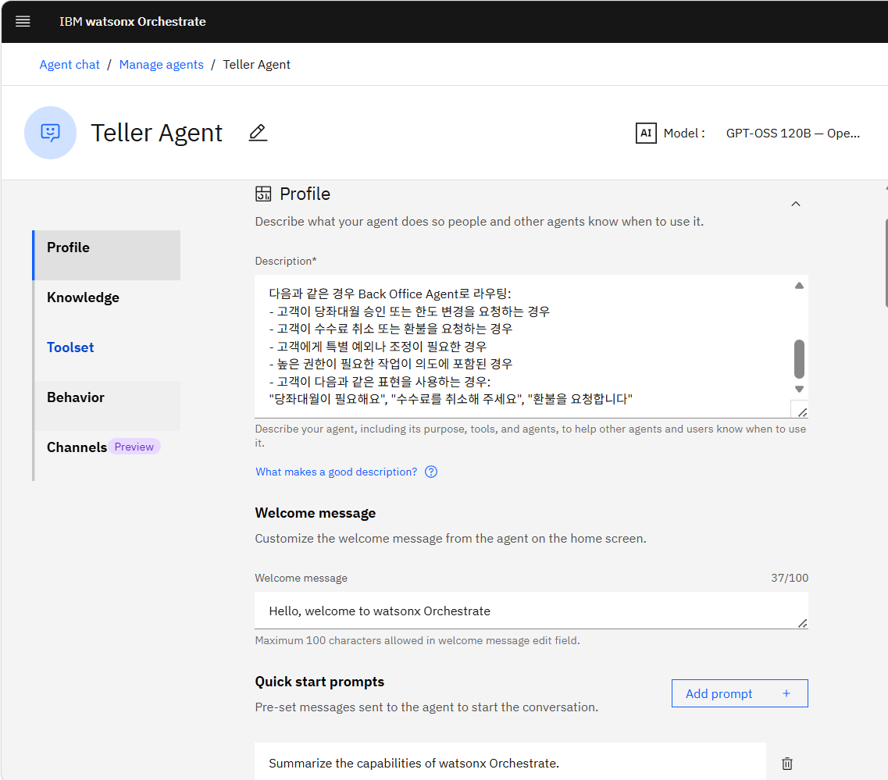
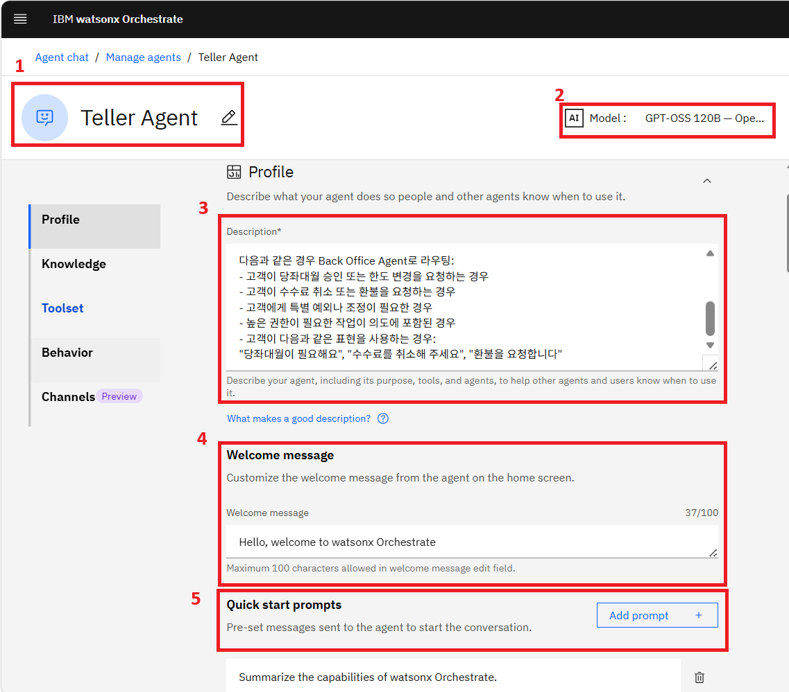

# Watsonx Orchestrate

## Create Agent

1. Create from Scratch

   1. 아무런 설정이 없는 상태에서 조직의 비즈니스 규칙에 100% 맞춰 에이전트를 설계하는 방식
2. Create from Template

   1. IBM이 미리 검증하고 만들어 둔 업무별/산업별 표준 에이전트 틀을 가져와 사용하는 방식

## Orchestrate Tools

* WatsonX Orchestrate에서는 Agent + Tools로 하나의 Agent를 바로 사용할 수 있도록 제공하고 있음
* Add Tools에서는 다양한 형태의 외부 Tool을 Agent에서 사용할 수 있도록 지원하고 있음

### Catalog

|**분류**|**대표적인 기본 제공 Tool 및 연동 앱**|**주요 역할**|
|-|-|-|
|Productivity|Microsoft365, Slack, Box|이메일 발송, 일정 등록,  드라이브 내 파일 검색 및 업로드,  알림 발송|
|HR (인사 관리)|Workday, SAP SuccessFactors, IBM 자체 HR 템플릿|직원 정보 조회,  휴가 신청 및 승인 프로세스,  채용 프로세스 자동화|
|Sales \& CRM (영업)|Salesforce, HubSpot|고객 데이터 조회 및 생성, 영업 기회 파이프라인 업데이트|
|It \& Support (고객 지원)|ServiceNow, Zendesk, Jira|서비스 데스크 티켓 생성, 장애 상황 전파, 이슈 트래킹 상태 변경|
|Procurement (조달/ERP)|SAP, AWS 관련 일부 관리 도구|구매 주문서(PO) 상태 확인, 벤더 정보 동기화|

| **분류** | **대표적인 기본 제공 Tool 및 연동 앱** | **주요 역할** |
| --- | --- | --- |
| Productivity | Microsoft365, Slack, Box | 이메일 발송, 일정 등록,  드라이브 내 파일 검색 및 업로드,  알림 발송 |
| HR (인사 관리) | Workday, SAP SuccessFactors, IBM 자체 HR 템플릿 | 직원 정보 조회,  휴가 신청 및 승인 프로세스,  채용 프로세스 자동화 |
| Sales & CRM (영업) | Salesforce, HubSpot | 고객 데이터 조회 및 생성, 영업 기회 파이프라인 업데이트 |
| It & Support (고객 지원) | ServiceNow, Zendesk, Jira | 서비스 데스크 티켓 생성, 장애 상황 전파, 이슈 트래킹 상태 변경 |
| Procurement (조달/ERP) | SAP, AWS 관련 일부 관리 도구 | 구매 주문서(PO) 상태 확인, 벤더 정보 동기화 |

### Local Instance

* 현재 사용 중인 Watsonx Orchestrate 환경(Workspace) 내에 이미 등록되어 있거나 다른 프로젝트에서 빌드해  둔 도구를 재사용할 때 선택

### MCP Server

* 오픈 소스 표준 규격인 MCP를 기반으로 작동하는 외부 도구 서버 연결

### Open API

* Swagger나 OpenAPI Specification(Json, Yaml) 문서 파일 업로드해 외부 Rest API를 도구로 만드는 방식

## Orchestrate Create Agent 화면

1. Agent 이름을 표시하는 창. 연필 모양을 눌러 수정 가능
2. 현재 사용중인 Base LLM을 선택하고 표시하는 창. 현재는 GPT-OSS 120B 사용중
3. 이 에이전트가 수행하는 역할과 처리 가능한 작업 범위를 텍스트로 정의하는 칸
4. 사용자가 에이전트와의 대화 창을 처음 열었을 때, 화면에 가장 먼저 표시되는 고정 인사말
5. 사용자가 질문을 직접 타이핑하지 않고도 클릭 한 번으로 대화를 시작할 수 있도록 돕는 ‘추천 질문 버튼’을 생성하는 기능

1. Agent가 사용자의 프롬프트를 해석하고, 목적을 달성하기 위해 어떤 방식으로 행동 계획을 세울지 결정하는 추론 알고리즘 모델 선택하는 영역
2. 모델 자체 내장된 능력에 의존해 프롬프트를 이해하고, 계획을 세우며, 지식과 도구를 호출하는 방식
3. 모델이 스스로 생각 → 행동 → 관찰 하는 과정을 만족스러운 결과가 나올 때까지 반복하며 접근 방식을 지속적으로 수정해 나가는 방식
4. 에이전트에게 텍스트 뿐만 아니라 음성 인터페이스를 부여하기 위한 설정 영역 (현 강의에서는 사용x)

1. 에이전트가 목표를 달성하고 사용자 질문에 정확하게 답변할 수 있도록, 참조할 수 있는 사내 문서나 데이터 원천을 제공하는 영역. LLM의 기본 학습 데이터에 없는 기업 고유의 도메인 지식을 활용하게 만드는 RAG의 기반
2. 에이전트가 접근할 수 있는 지식의 저장소들을 모아놓고 관리하는 리스트. Add source를 통해 정보를 불러올 수 있음

1. 사용자 요청을 처리하기 위해 직접 실행할 수 있는 외부 API나 기능적 도구를 연결하고 관리

   Add tool을 통해 도구를 추가할 수 있으며, 하단 리스트로 사용중인 Tool 확인 가능

2. 현재 Agent가 직접 처리하기 어렵거나 권한이 없는 특정 작업을 위임할 수 있는 에이전트를 지정하는 영역. 이를 통해 멀티 에이전트 구조를 형성함

   Add agent를 통해 에이전트를 추가할 수 있으며, 하단 리스트로 연결된 Agent 확인 가능

   

1. Agent가 대화를 진행할 때, 판단의 근거로 삼을 핵심 Rule과 페르소나를 주입하는 영역
2. Agent가 무엇을 해야 하고, 어떻게 응답해야 하며, 어떤 제한 사항을 따라야 하는지 자연어로 상세히 기술하는 메인 입력창. 일반적인 LLM의 System Prompt 역할
3. Instructions에 적힌 지침 외에 Agent의 특정 행동이나 응답을 제어하는 세부 Rule 들을 개별 단위로 분리하여 추가하는 기능.

   Add Guideline을 통해 개별 규칙을 새롭게 생성할 수 있음

   ex) “고객의 비밀번호나 보안 카드는 절대 대화창에 노출하지 마세요”, “금융 상품을 추천할 때는 반드시 투자 유의 사항 문구를 접미사로 붙이세요”

   

* User Prompt에서 첨부 파일 첨부 가능 여부와 그 갯수를 지정하는 영역

  

1. 팀원들이 소통하는 다양한 비즈니스 커뮤니케이션 플랫폼 및 웹 환경에 Agent를 연결하는 영역. 각 항목의 화살표를 누르면 해당 채널의 API 키나 인증 정보를 입력할 수 있는 상세 창이 열림
2. Channels

   1. Home page

      Watsonx Orchestrate의 메인 홈 화면에 이 Agent를 노출할지 여부를 결정

   2. Embedded Agent

      사내 인트라넷, 일반 웹사이트 등에 위젯 형태로 심을 수 있는 챗 창(Chat UI)를 커스텀하고 관련 스크립트 코드를 추출하는 채널

   3. Teams (Microsoft Teams)

      Teams 앱 내에 Agent를 봇으로 등록해 대화창에서 Agent와 대화하고 작업 명령을 할 수 있도록 연결

   4. WhatsApp with Twilio

      클라우드 통신 플랫폼인 Twilio를 매개로 글로벌 모바일 메신저인 WhatsApp과 Agent를 연동

   5. Facebook Messenger

      페이스북 메신저 채널을 활성화해 사용자들이 SNS 메신저 창을 통해 Agent와 대화할 수 있도록 지원

   6. Genesys Bot Connector

      글로벌 고객 센터 및 상담원 시스템 솔루션인 Genesys Cloud의 봇 커넥터와 연동하여, 고객 채널의 1차 응대 봇으로 Agent를 투입할 수 있게 함

   7. Slack

      사내 협업 툴인 Slack 환경을 선택하고 구성하여, Slack 워크스페이스 내에서 Agent가 작동할 수 있도록 연결

   8. Phone with Genesys Audio Connector

      Genesys의 오디오 커넥터를 활용해 에이전트를 실제 전화 통화 채널로 연결할 수 있도록 구성
